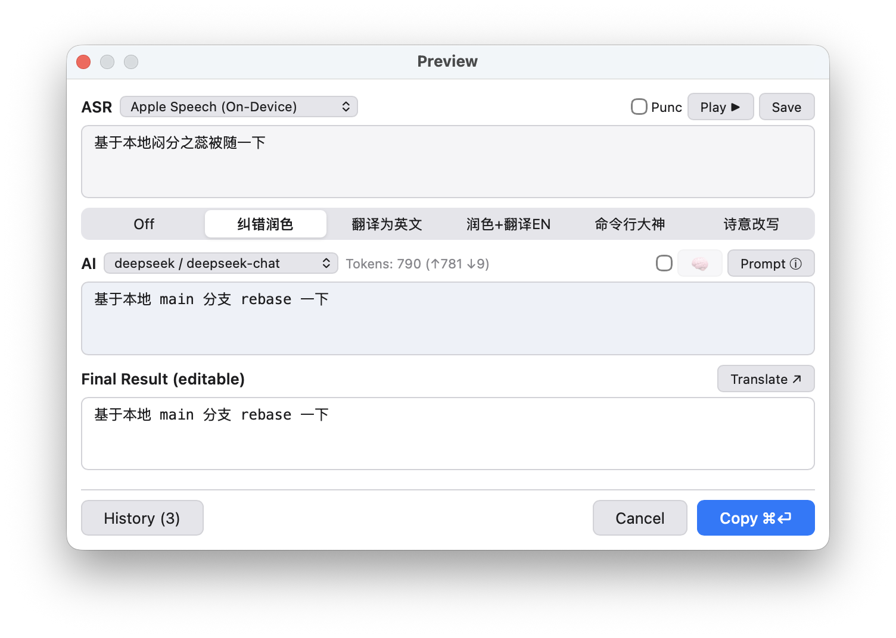
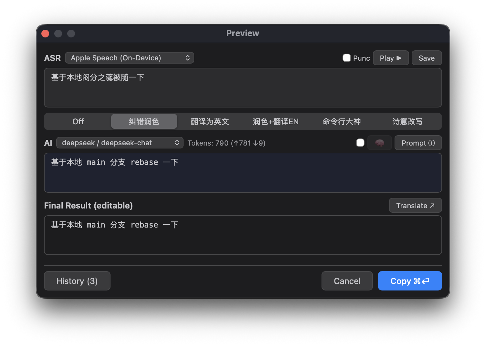

# 闻字 (WenZi)

[](https://discord.gg/XbNSPEHc)

A macOS menubar speech-to-text app with a built-in keyboard-driven launcher. Hold a hotkey to record, release to transcribe and type the result into the active app — or use the Alfred/Raycast-style launcher to search apps, files, clipboard history, and more.

<p align="center">
  
  
</p>

## Features

- **Speech-to-Text** — Offline-first with multiple backends: FunASR (Chinese ONNX), Apple Speech (built-in), MLX-Whisper (99 languages, Apple Silicon GPU), and remote Whisper API
- **AI Enhancement** — LLM-powered proofreading, translation, and custom chain modes via any OpenAI-compatible API, with vocabulary retrieval and conversation history for better accuracy
- **Clipboard Enhance** — AI-enhance selected text in any app with a hotkey
- **Launcher** — Alfred/Raycast-style search panel for apps, files, clipboard history, bookmarks, and snippets
- **Scripting** — Python-based automation with leader keys, global hotkeys, timers, and pasteboard access
- **Lightweight** — Menubar-only app with full dark mode support

## Quick Start

### Download Release (Recommended)

Download `WenZi.app` from the [Releases](https://github.com/Airead/WenZi/releases) page, drag to `/Applications`, and launch.

> **Lite Edition:** A minimal build without large local ASR dependencies — much smaller download, ideal for users who primarily need the launcher and only occasional voice input via remote API.

> **First launch:** macOS will block unsigned apps. Go to **System Settings → Privacy & Security** and click **Open Anyway**.

### Build from Source

```bash
git clone https://github.com/Airead/WenZi && cd WenZi
uv sync
./scripts/build.sh          # Build WenZi.app (output in dist/)
# or: ./scripts/build-dmg.sh  # Build DMG installer
```

### Run from Source (Development)

```bash
git clone https://github.com/Airead/WenZi && cd WenZi
uv sync
uv run python -m wenzi
```

### Requirements

- macOS (Apple Silicon recommended for MLX-Whisper)
- Build/dev: Python 3.13+ and [uv](https://github.com/astral-sh/uv)

The default FunASR backend downloads models (~500 MB) on first use. The menubar icon shows progress (`DL X%`).

### Permissions

On first launch the app will prompt for **Microphone**, **Accessibility**, and optionally **Speech Recognition** (Apple Speech backend only).

## Documentation

| Guide | Description |
|-------|-------------|
| **[User Guide](docs/user-guide.md)** | Start here — progressive guide from first launch to advanced usage |
| [Configuration](docs/configuration.md) | Full config reference and environment variables |
| [Provider & Model Setup](docs/provider-model-guide.md) | Step-by-step ASR and LLM provider setup |
| [AI Enhancement Modes](docs/enhance-modes.md) | Customize and create enhancement modes |
| [Enhancement Mode Examples](docs/enhance-mode-examples.md) | Ready-to-use mode templates |
| [Prompt Optimization](docs/prompt-optimization-workflow.md) | Systematic prompt improvement workflow |
| [Conversation History](docs/conversation-history-enhancement.md) | How conversation history improves accuracy |
| [Scripting API](docs/scripting.md) | Leader keys, hotkeys, and automation APIs |

## Testing

```bash
uv run pytest
```

## License

MIT
